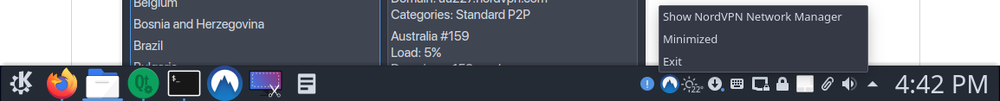
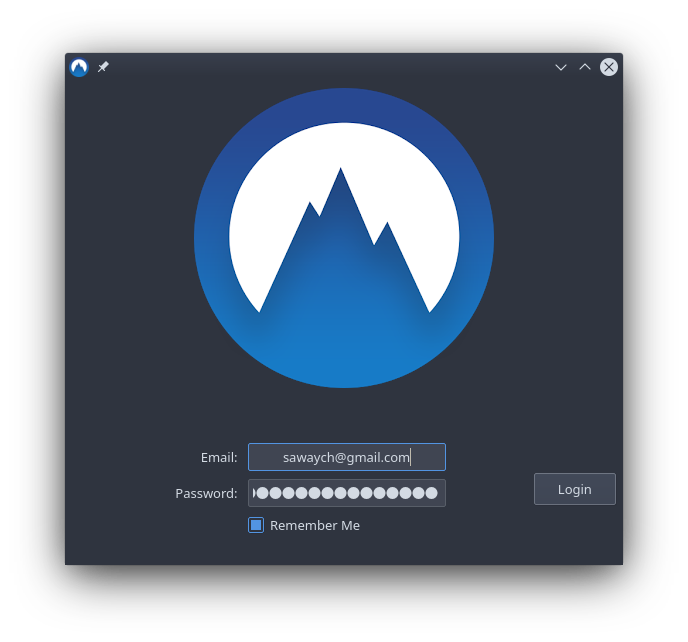

# Log

This is the update log of [sawa/NordVPN-NetworkManager-Gui](https://github.com/sawaYch/NordVPN-NetworkManager-Gui) fork to [vfosterm/NordVPN-NetworkManager-Gui](https://github.com/vfosterm/NordVPN-NetworkManager-Gui). Thank you the nice job of vfosterm. I am quite interested in this project. 

Now I have done the followings:

- [x] Hide NordVPN NM GUI in System Tray

- [x] Remember  Me

## System Tray

Right click to open a menu, to select hide or show;
Close button of the application no long exit the program, but hiding the application window to system tray.

## Remember Me

Application now can remember user account. 

### Implementation

Use a file to store the user account, and each time check if the file exist, use the account name as key to query the corresponding password by using python3-keyring  package. I am not sure whether it is really secure or not 🤔

It means users are required to install python3-keyring first.

for Ubuntu 18.04, you can see my [gists notes]( https://gist.github.com/sawaYch/dbc64c93e7d1b10e1da5f1c5d3c6e505#file-python3-keyring-md).